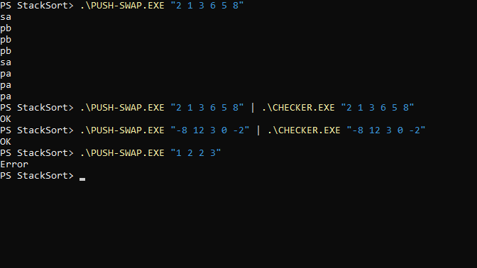

# StackSort: Two-Stack Sorting & Validation Tool

StackSort is a Go command-line project that sorts distinct integers using two stacks and a restricted instruction set. It contains two programs:

- `push-swap` generates instructions that sort stack A in ascending order.
- `checker` executes instructions from standard input and reports `OK` when A is sorted and B is empty, or `KO` otherwise.

Built as a learning project in stack operations, sorting algorithms, and command-line input validation. Both programs use only Go's standard library. The original separate implementations, stack helpers, and small-stack sorting cases are retained. Targeted additions reuse these helpers to reduce instruction counts.

## Screenshot



The sorter generates stack instructions; the checker verifies the result. This run also demonstrates negative values and duplicate-input rejection.

## Features

- Eleven stack instructions, including combined swaps and rotations.
- Dedicated sorting cases for two and three values, reused when finishing four- to six-value inputs.
- Grouped pushes for larger inputs, with the shortest sequence selected from three nearby group sizes.
- Validation of integer syntax, integer overflow, duplicate values, and malformed instructions.
- Plain `Error` output on stderr and a nonzero exit status for invalid input.
- Manual audit examples for sorting, error handling, and instruction validation.

## Setup

Requires Go 1.22.4 or newer (as declared in `go.mod`). Verified locally with Go 1.23.4 on Windows.

```sh
git clone https://github.com/ihamzaihsan/stack-sort.git
cd stack-sort
go build -o push-swap ./SwapProg
go build -o checker ./CheckerProg
```

On Windows, build with executable extensions:

```powershell
go build -o push-swap.exe ./SwapProg
go build -o checker.exe ./CheckerProg
```

## Usage

Pass the integers as **one quoted argument**. The first value is the top of stack A. Stack B starts empty. Spaces, tabs, and surrounding whitespace are accepted. Values must fit the platform's Go `int` range and must be distinct; negative values are supported.

```sh
./push-swap "2 1 3 6 5 8"
# Prints 8 instructions, one per line.

./push-swap "2 1 3 6 5 8" | ./checker "2 1 3 6 5 8"
# OK

echo -e "rra\npb\nsa\nrra\npa" | ./checker "3 2 1 0"
# OK

./push-swap "1 2 2 3"
# Error (stderr; exit status 1)
```

PowerShell example:

```powershell
.\push-swap.exe "2 1 3 6 5 8" | .\checker.exe "2 1 3 6 5 8"
# OK
```

No arguments produce no output. An empty quoted argument or additional arguments produce `Error`. Already sorted input produces no sorting instructions. Checker reads until end-of-file; each instruction must occupy its own line with no extra spaces or tokens. LF and CRLF line endings and a final line without a newline are accepted. Blank lines and input-reading errors are rejected. `KO` is a completed validation result and uses exit status 0.

## Instructions

| Instruction | Effect |
| --- | --- |
| `pa` | Push the top of B onto A |
| `pb` | Push the top of A onto B |
| `sa` / `sb` | Swap the top two values of A / B |
| `ss` | Swap the top two values of both stacks |
| `ra` / `rb` | Move the top value of A / B to the bottom |
| `rr` | Rotate both stacks |
| `rra` / `rrb` | Move the bottom value of A / B to the top |
| `rrr` | Reverse rotate both stacks |

Swapping or rotating a stack with fewer than two values leaves it unchanged. The checker treats pushing from an empty source stack as `Error`; the sorter skips these pushes.

## Sorting approach and limits

For two or three values, the sorter uses the original short swap/rotation sequences. For four to six values, it uses the original minimum-first approach until only three values remain, then reuses the three-value solution before pushing the extracted minima back from B.

For larger inputs, integer ranks identify groups of low values. The sorter pushes these groups to B, rotates smaller values deeper into B, then returns the largest remaining values to A first. This produces ascending order in A. It tries three nearby group sizes on copies of the input and emits the shortest resulting sequence. All movements use the existing push and rotation functions.

The algorithm uses comparisons to determine ranks. It generates valid sorting instructions and targets the supplied audit's limits; it does not guarantee a globally shortest sequence.

Results measured during the development review with Go 1.23.4 on Windows:

| Check | Result | Supplied audit target |
| --- | --- | --- |
| Six-value audit example | 8 instructions, checker returns `OK` | Fewer than 9 |
| All 6 three-value permutations | Maximum 2 instructions | Valid sorting |
| All 120 five-value permutations | Maximum 10 instructions | Fewer than 12 |
| 1,000 seeded random 100-value inputs | Maximum 618 instructions; correct final stacks | Fewer than 700 (bonus) |
| 20 seeded random 500-value inputs | Maximum 5,208 instructions; correct final stacks | No 500-value target in the supplied audit |

These measurements were taken before the review test files were removed. They are historical results, not a proof of a bound for every possible larger input. The repository retains manual testing only. The supplied audit's social questions and reviewer judgments require human assessment.

## Verification

```sh
go build ./...
go vet ./...
gofmt -l SwapProg CheckerProg
```

After building `push-swap` and `checker`, run the manual script from the repository root in Bash (for example, Git Bash or Linux):

```bash
bash testaudit.sh
```

The script uses `echo -e` to supply instructions. Inspect the results: the first checker instruction example should return `KO`; the second and both sorter/checker pipelines should return `OK`. Invalid values and duplicates should print `Error` on stderr, while missing arguments and already sorted sorter inputs should produce no output. The script does not automatically assert an audit pass. No automated test files are included.

## Project layout

```text
SwapProg/main.go          Original sorting program
CheckerProg/main.go       Original instruction validator
testaudit.sh              Manual audit examples
go.mod                   Go module configuration
```

The module name `PushSwap` is retained from the original project; the portfolio project name is StackSort.
